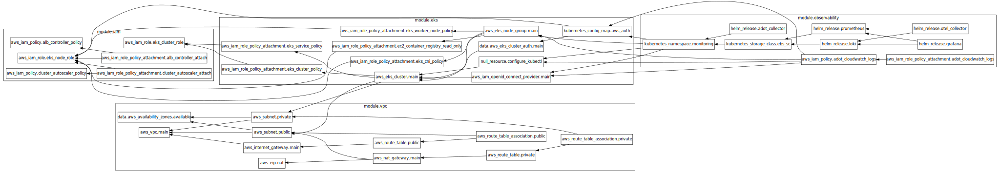

# JUCR DevOps Challenge — Kubernetes & Observability Stack

## Solution Overview

This repository contains a fully automated, production-grade Kubernetes platform on AWS, provisioned and managed 100% with Terraform.  
It is designed for **high availability, scalability, and deep observability**, with all infrastructure and operational components as code.

---

## Architecture Diagram

---

## Terraform Dependency Graph

---

## Key Capabilities

### 1. **Scalability**

- **Node Auto Scaling:**  
  The EKS node group is configured with Cluster Autoscaler, allowing the cluster to automatically add or remove EC2 nodes based on workload demand.
- **Pod Auto Scaling:**  
  Horizontal Pod Autoscaler (HPA) is enabled for workloads, so pods scale up/down based on CPU/memory or custom metrics.
- **Multi-AZ Deployment:**  
  All nodes are distributed across at least three Availability Zones, ensuring that scaling events and failures are handled gracefully and workloads are always schedulable.

### 2. **High Availability**

- **Multi-AZ Node Groups:**  
  Nodes are provisioned in three or more AZs, so even if an entire AZ fails, the cluster remains operational.
- **Highly Available Control Plane:**  
  EKS control plane is managed by AWS and is highly available by default.
- **Redundant Observability Stack:**  
  Observability components (Prometheus, Grafana, ADOT, etc.) are deployed with high-availability settings and persistent storage (EBS/EFS) where needed.

### 3. **Customizability**

- **Modular Terraform:**  
  Each component (EKS, IAM, Observability, etc.) is a separate module, making it easy to enable/disable or swap out technologies.
- **Toggle Observability Components:**  
  Enable or disable Prometheus, Loki, Grafana, and ADOT via simple Terraform variables.
- **Flexible Storage:**  
  Choose between EBS, EFS, or ephemeral storage for observability components.
- **Configurable Retention and Resource Limits:**  
  All key parameters (retention, storage size, resource requests/limits) are exposed as variables.

### 4. **Full Observability**

- **Metrics:**  
  Prometheus collects cluster and application metrics, with dashboards in Grafana.
- **Logs:**  
  Logs are collected via ADOT Collector and sent to AWS CloudWatch Logs, viewable in Grafana.
- **Dashboards:**  
  Pre-configured Grafana dashboards for cluster health, node/pod status, and application metrics.
- **Alerting:**  
  (Optional) Alertmanager or Grafana alerts can be enabled for proactive notifications.

### 5. **Automation & Maintainability**

- **One-Command Deployment:**  
  The entire stack (network, IAM, EKS, observability) is deployed with a single `terraform apply`.
- **No Third-Party Modules:**  
  All resources are defined natively in Terraform for transparency and learning.
- **Documented Assumptions & Steps:**  
  All design decisions, assumptions, and steps are documented in this repo.
- **GitOps Ready:**  
  All changes are tracked in Git for auditability and easy rollbacks.

### 6. **Security**

- **IAM Roles for Service Accounts (IRSA):**  
  Least-privilege IAM roles are used for Kubernetes service accounts (e.g., ADOT, EBS CSI).
- **Secrets Management:**  
  Sensitive values (Grafana admin, etc.) are managed via Terraform variables and can be integrated with secret stores.

---

## Additional Capabilities

- **Cost Optimization:**  
  Scrape intervals, log retention, and resource requests are tuned for cost efficiency.
- **Extensible:**  
  Easily add more exporters, receivers, or integrations (e.g., X-Ray, S3, custom dashboards).
- **Self-Healing:**  
  Kubernetes and AWS features ensure failed nodes/pods are automatically replaced.

---

## Ongoing Maintenance Tasks

- **Terraform Plan & Apply:**  
  Regularly review and apply infrastructure changes via Terraform.
- **Upgrade Kubernetes & Helm Charts:**  
  Periodically update EKS version and observability stack components.
- **Monitor Costs:**  
  Review AWS billing and tune retention/scrape intervals as needed.
- **Review IAM Policies:**  
  Audit and rotate IAM credentials and policies for least privilege.
- **Backup & Disaster Recovery:**  
  Ensure EBS/EFS volumes are backed up if persistent storage is used.

---

## Assumptions

- AWS account and VPC are available for provisioning.
- All infrastructure is managed via Terraform; no manual changes in AWS Console.
- Observability requirements include both metrics and logs, with visualization in Grafana.

---

## Quick Start
0. Go to infra directory `cd infra`
1. Clone this repo and review `terraform.tfvars`.
2. Run `terraform init` and `terraform apply`.
3. Access Grafana and Prometheus via port-forward or LoadBalancer.
4. View logs in AWS CloudWatch and metrics in Grafana dashboards.

---

**This solution is designed for maximum uptime, deep insights, and easy extensibility—ready for production workloads**